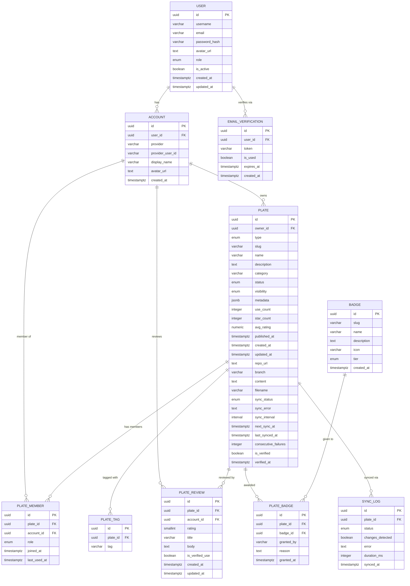

# Kickplate — database design

## Overview

The Kickplate database is designed around three core principles: **minimal anomalies** through normalization to 3NF, **flexibility** to support all three auth modes without schema changes, and **scalability** through strategic denormalization of hot-path aggregates. It consists of 11 tables organized across five domains: identity, security, plates, social, and sync.

The central identity decision is that `account` is the universal identity anchor. Regardless of how a user authenticates — session username/password, SSO token, or header value — the auth layer always resolves to a single `account.id`. Every downstream table references `account.id` via a proper FK.

---

## Table of contents

1. [Domain overview](#domain-overview)
2. [Plate types](#plate-types)
3. [Tables](#tables)
4. [Normal forms and anomaly analysis](#normal-forms-and-anomaly-analysis)
5. [Synchronizer design](#synchronizer-design)
6. [Scalability design](#scalability-design)
7. [Auth mode flexibility](#auth-mode-flexibility)
8. [Index strategy](#index-strategy)
9. [Entity relationship diagram](#entity-relationship-diagram)

---

## Domain overview

```
Identity domain      →  user, account
Security domain      →  email_verification
Plate domain         →  plate, plate_member, plate_tag
Social domain        →  plate_review, badge, plate_badge
Sync domain          →  sync_log
```

---

## Plate types

A plate can be one of two types:

**Repository plate** — points to a public GitHub repository containing a `kickplate.yaml` at its root. The yaml file describes the plate and must include an `owner` field matching the authenticated user's username. This proves the submitter has write access to the repo. The synchronizer periodically re-fetches `kickplate.yaml` to keep plate metadata up to date. No per-user GitHub auth is needed — all repos are public and fetched using a single service-level GitHub token stored in config. The plate detail page renders the `README.md` from the repository root directly — no separate description field needed.

```yaml
# kickplate.yaml inside the repo
owner: moeidheidari
name: go-microservice-grpc
description: Production-ready Go microservice with gRPC
category: backend
tags: [go, grpc, docker]
dependencies:
  - name: postgres
    version: "16"
  - name: redis
    version: "7"
variables:
  - name: service_name
    required: true
  - name: go_version
    default: "1.22"
```

**File plate** — a single file (Dockerfile, docker-compose.yml, GitHub Actions workflow, Nginx config, Makefile, etc.) created directly in the Kickplate UI. The content is stored in the database. No repository needed. The authenticated user is the implicit owner — no ownership verification required.

| | Repository plate | File plate |
|---|---|---|
| Source | Public GitHub repo | Kickplate UI |
| Ownership proof | `owner` field in `kickplate.yaml` | Authenticated session |
| Content stored in DB | No — fetched from GitHub | Yes — `plate.content` |
| Synchronizer | Yes — periodic re-sync | No |
| `repo_url` | Required | Null |
| `content` | Null | Required |

---

## Tables

### `user`

Populated only for session-based auth (username/password login). SSO and header users have no row here — their identity lives entirely in `account`. The `role` column drives admin access control across the system.

| Column | Type | Notes |
|---|---|---|
| `id` | `uuid` PK | |
| `username` | `varchar(32)` | unique, indexed |
| `email` | `varchar(255)` | unique, indexed |
| `password_hash` | `varchar(255)` | bcrypt, never stored plain |
| `avatar_url` | `text` | nullable — custom upload, overrides provider avatar |
| `role` | `enum(member, admin)` | default: member |
| `is_active` | `boolean` | false until email verified |
| `created_at` | `timestamptz` | |
| `updated_at` | `timestamptz` | |

### `account`

The universal identity anchor for all auth modes. Every authentication path — session, SSO, or header — resolves to one `account` row. All downstream tables reference `account.id` via a proper FK.

`user_id` is a nullable FK to `user`. Populated only for session auth — null for SSO and header accounts.

| Column | Type | Notes |
|---|---|---|
| `id` | `uuid` PK | referenced by all identity-dependent tables |
| `user_id` | `uuid` nullable FK → user | populated for session auth only |
| `provider` | `varchar(64)` | `local`, `github`, `gitlab`, `sso`, `header` |
| `provider_user_id` | `varchar(255)` | raw id from the external system |
| `display_name` | `varchar(255)` | nullable |
| `avatar_url` | `text` | nullable — synced from provider on every login |
| `created_at` | `timestamptz` | |

Unique constraint on `(provider, provider_user_id)` prevents duplicate accounts per provider.

**Avatar resolution:** `account.avatar_url` is the provider avatar refreshed on every login. `user.avatar_url` is an explicit custom upload and takes priority when set:

```
user.avatar_url != null  →  use custom upload
otherwise               →  use account.avatar_url from provider
```

**Identity resolution flow:**

```
Session login  → verify password against user row → find or create account WHERE provider='local'
SSO login      → extract subject from token       → find or create account WHERE provider='sso'
Header login   → extract value from header        → find or create account WHERE provider='header'
```

All three paths produce one `account.id` used for all subsequent queries.

### `email_verification`

Separate from `user` to avoid nullable columns on the main table. One row per verification attempt — used tokens are marked rather than deleted, for audit purposes.

| Column | Type | Notes |
|---|---|---|
| `id` | `uuid` PK | |
| `user_id` | `uuid` FK → user | |
| `token` | `varchar(255)` | SHA-256 of the emailed token |
| `is_used` | `boolean` | default false |
| `expires_at` | `timestamptz` | typically +24h from creation |
| `created_at` | `timestamptz` | |

### `plate`

The core entity. Supports two types: `repository` and `file`. Type-specific columns are null when not applicable — sync columns and `repo_url` are null for file plates; `content` and `filename` are null for repository plates.

`metadata` is `jsonb` holding the parsed `kickplate.yaml` for repository plates, or a minimal descriptor for file plates. Dependencies live inside `metadata` — they are descriptive information, not a relational concern requiring indexed lookups.

`avg_rating` and `star_count` are intentional denormalizations maintained as running totals to avoid expensive aggregation on every page render.

| Column | Type | Notes |
|---|---|---|
| `id` | `uuid` PK | |
| `owner_id` | `uuid` FK → account | |
| `type` | `enum(repository, file)` | determines which columns are active |
| `slug` | `varchar(255)` | unique, url-safe, indexed |
| `name` | `varchar(255)` | |
| `description` | `text` | markdown supported |
| `category` | `varchar(100)` | indexed for filtering |
| `status` | `enum(pending, approved, rejected, archived)` | |
| `visibility` | `enum(public, private, unlisted)` | |
| `metadata` | `jsonb` | parsed kickplate.yaml or file descriptor |
| `use_count` | `integer` | denormalized, incremented on each use |
| `star_count` | `integer` | denormalized, maintained by app layer |
| `avg_rating` | `numeric(3,2)` | denormalized, recalculated on review write |
| `is_verified` | `boolean` | default false — true when owner field matched submitter, always true for file plates |
| `verified_at` | `timestamptz` | nullable — when verification passed |
| `published_at` | `timestamptz` | nullable — null while pending |
| `created_at` | `timestamptz` | |
| `updated_at` | `timestamptz` | |
| `repo_url` | `text` | nullable — repository plates only |
| `branch` | `varchar(255)` | nullable — repository plates only, default: `main` |
| `content` | `text` | nullable — file plates only, raw file content |
| `filename` | `varchar(255)` | nullable — file plates only, e.g. `Dockerfile` |
| `sync_status` | `enum(pending, syncing, synced, failed, unverified)` | nullable — repository plates only |
| `sync_error` | `text` | nullable — last sync error message |
| `sync_interval` | `interval` | nullable — default `6 hours` for repository plates |
| `next_sync_at` | `timestamptz` | nullable — computed: `last_synced_at + sync_interval` |
| `last_synced_at` | `timestamptz` | nullable — when last successful sync ran |
| `consecutive_failures` | `integer` | default 0 — reset to 0 on successful sync |

**Repository plate metadata example:**

```json
{
  "owner": "moeidheidari",
  "language": "go",
  "framework": "chi",
  "variables": [
    { "name": "service_name", "required": true },
    { "name": "go_version", "default": "1.22" }
  ],
  "dependencies": [
    { "name": "postgres", "version": "16" },
    { "name": "redis", "version": "7" }
  ]
}
```

**File plate metadata example:**

```json
{
  "language": "go",
  "file_type": "dockerfile"
}
```

### `plate_member`

Resolves the many-to-many relationship between accounts and plates. `last_used_at` tracks when a member last used this plate and drives the `is_verified_use` flag on reviews.

| Column | Type | Notes |
|---|---|---|
| `id` | `uuid` PK | |
| `plate_id` | `uuid` FK → plate | |
| `account_id` | `uuid` FK → account | |
| `role` | `enum(owner, member)` | |
| `joined_at` | `timestamptz` | |
| `last_used_at` | `timestamptz` | nullable |

Unique constraint on `(plate_id, account_id)`.

### `plate_tag`

Tags are normalized into their own table rather than stored as an array column. This allows efficient queries like "find all plates tagged with `go` and `grpc`" via indexed lookups. Tags are the primary navigation filter — this is why they are a table while dependencies are not.

| Column | Type | Notes |
|---|---|---|
| `id` | `uuid` PK | |
| `plate_id` | `uuid` FK → plate | cascade delete |
| `tag` | `varchar(100)` | lowercase, trimmed |

Unique constraint on `(plate_id, tag)`.

### `plate_review`

Combines rating and written review into one row. A user can rate without writing a review (body is nullable), but cannot write a review without a rating. `is_verified_use` is set when the account has a `plate_member` row with a non-null `last_used_at`.

| Column | Type | Notes |
|---|---|---|
| `id` | `uuid` PK | |
| `plate_id` | `uuid` FK → plate | |
| `account_id` | `uuid` FK → account | |
| `rating` | `smallint` | 1–5, not null |
| `title` | `varchar(255)` | nullable |
| `body` | `text` | nullable |
| `is_verified_use` | `boolean` | true if account has used this plate |
| `created_at` | `timestamptz` | |
| `updated_at` | `timestamptz` | |

Unique constraint on `(plate_id, account_id)`.

### `badge`

A catalog of available badges. New badge types are added as rows — no schema change needed. The `tier` enum drives visual treatment in the UI.

| Column | Type | Notes |
|---|---|---|
| `id` | `uuid` PK | |
| `slug` | `varchar(100)` | unique — e.g. `official`, `verified`, `popular`, `featured` |
| `name` | `varchar(255)` | display name |
| `description` | `text` | what this badge means |
| `icon` | `varchar(255)` | icon identifier |
| `tier` | `enum(community, verified, official, sponsored)` | |
| `created_at` | `timestamptz` | |

### `plate_badge`

Links plates to badges. A plate can hold multiple badges. `granted_by` stores the `account_id` of the admin or the string `system` for automatically awarded badges.

| Column | Type | Notes |
|---|---|---|
| `id` | `uuid` PK | |
| `plate_id` | `uuid` FK → plate | |
| `badge_id` | `uuid` FK → badge | |
| `granted_by` | `varchar(255)` | account_id or `system` |
| `reason` | `text` | nullable — internal audit note |
| `granted_at` | `timestamptz` | |

Unique constraint on `(plate_id, badge_id)`.

### `sync_log`

An audit trail of every sync attempt for repository plates. Kept for 30 days then cleaned up by a nightly job. Critical for debugging why a plate did not update.

| Column | Type | Notes |
|---|---|---|
| `id` | `uuid` PK | |
| `plate_id` | `uuid` FK → plate | |
| `status` | `enum(success, failed, skipped)` | |
| `changes_detected` | `boolean` | was kickplate.yaml different from last sync? |
| `error` | `text` | nullable — error message if failed |
| `duration_ms` | `integer` | how long the sync took in milliseconds |
| `synced_at` | `timestamptz` | |

---

## Normal forms and anomaly analysis

### First normal form (1NF) ✓

Every column holds atomic values. Tags and badges that might tempt a designer to use arrays are extracted into their own tables. The only exception is `plate.metadata` (jsonb) — a deliberate and bounded deviation for flexible config fields that change with the kickplate.yaml spec, not with the data model.

### Second normal form (2NF) ✓

All primary keys are single-column UUIDs, so partial dependency (the 2NF violation) is structurally impossible.

### Third normal form (3NF) ✓

No transitive dependencies exist. Each non-key column depends only on the primary key. Badge metadata lives on `badge`, not duplicated on `plate_badge`. Tag strings live on `plate_tag`, not duplicated anywhere.

### Insertion anomaly — eliminated

Inserting a tag, review, or badge for any plate is always a single `INSERT` into the relevant table. No special cases for empty states.

### Update anomaly — eliminated

Renaming a badge requires exactly one `UPDATE badge WHERE id = ?`. No fan-out update across multiple rows.

### Deletion anomaly — eliminated

Cascade deletes are defined on all child tables (`plate_tag`, `plate_review`, `plate_badge`, `plate_member`, `sync_log`). Deleting a plate removes all associated rows atomically.

### Intentional denormalizations (controlled anomaly risk)

`avg_rating` and `star_count` on `plate` are denormalized for read performance. Both are updated in the same transaction as their source write. A nightly reconciliation job re-syncs both from source tables to catch any drift.

---

## Synchronizer design

The synchronizer is a background service (or goroutine with a ticker) that periodically re-fetches `kickplate.yaml` from GitHub's public API for all repository plates. It runs independently of the request lifecycle. No per-user GitHub auth is needed — all repos are public and accessed via a single service-level token stored in `config.yaml`.

### How it selects plates to sync

```sql
SELECT * FROM plate
WHERE type = 'repository'
AND next_sync_at <= now()
AND sync_status != 'syncing'
ORDER BY next_sync_at ASC
LIMIT 50;
```

`next_sync_at` is stored explicitly — computed as `last_synced_at + sync_interval` at write time. This makes the scheduler query a simple indexed range scan.

### Sync flow

```
Scheduler wakes up every minute
  → SELECT plates WHERE next_sync_at <= now()
  → For each plate (parallel workers):

      1. SET sync_status = 'syncing'

      2. GET https://api.github.com/repos/{owner}/{repo}/contents/kickplate.yaml
         (service-level token from config.yaml)

      3a. Success:
            → parse and compare with plate.metadata
            → if changed: UPDATE plate SET metadata = ?, updated_at = now()
            → SET sync_status = 'synced', consecutive_failures = 0
            → SET last_synced_at = now(), next_sync_at = now() + sync_interval
            → INSERT sync_log (success, changes_detected)

      3b. Failure (network error or non-200):
            → SET sync_status = 'failed', sync_error = message
            → SET consecutive_failures = consecutive_failures + 1
            → SET next_sync_at = now() + backoff(consecutive_failures)
            → INSERT sync_log (failed, error)

      3c. Repo gone or kickplate.yaml missing:
            → SET sync_status = 'unverified'
            → notify plate owner
            → INSERT sync_log (failed, 'repo not found')
```

### Backoff strategy

| Consecutive failures | Next retry |
|---|---|
| 1 | 30 minutes |
| 2 | 2 hours |
| 3 | 12 hours |
| 4+ | 24 hours + owner notification |

### Ownership verification on initial import

```
User submits repo URL
→ backend fetches kickplate.yaml immediately (not via scheduler)
→ checks metadata.owner == authenticated account username
→ match     → plate created with sync_status = 'synced', is_verified = true, verified_at = now()
→ mismatch  → reject: "owner field does not match your username"
→ missing   → reject: "kickplate.yaml not found in repository"
```

The synchronizer also re-checks the `owner` field on every sync. If it changes to a different username, `is_verified` is set back to `false` and `sync_status` is set to `unverified` — protecting against someone transferring a repo and having it still appear as verified under the original owner.

### sync_log retention

```sql
DELETE FROM sync_log WHERE synced_at < now() - interval '30 days';
```

---

## Scalability design

### UUID primary keys

All primary keys use UUID v4, avoiding the hot-spot problem of sequential integer PKs in distributed databases. UUIDs distribute writes uniformly across shards.

### Partitioning-ready tables

`plate_review` is a candidate for range partitioning by `created_at` when volume grows. `sync_log` is handled by the 30-day retention cleanup.

### Indexing hot paths

```sql
-- Plate discovery
CREATE INDEX idx_plate_type_status ON plate(type, status);
CREATE INDEX idx_plate_status_category ON plate(status, category);
CREATE INDEX idx_plate_slug ON plate(slug);
CREATE INDEX idx_plate_owner ON plate(owner_id);
CREATE INDEX idx_plate_avg_rating ON plate(avg_rating DESC);
CREATE INDEX idx_plate_use_count ON plate(use_count DESC);

-- Synchronizer query (partial index — only repo plates not currently syncing)
CREATE INDEX idx_plate_next_sync ON plate(next_sync_at)
  WHERE type = 'repository' AND sync_status != 'syncing';

-- Tag filtering
CREATE INDEX idx_plate_tag_tag ON plate_tag(tag);
CREATE INDEX idx_plate_tag_plate ON plate_tag(plate_id);

-- Auth lookups
CREATE INDEX idx_account_user_id ON account(user_id) WHERE user_id IS NOT NULL;
CREATE INDEX idx_account_provider ON account(provider, provider_user_id);
CREATE INDEX idx_user_email ON "user"(email);
CREATE INDEX idx_user_username ON "user"(username);

-- Member and review lookups
CREATE INDEX idx_plate_member_account ON plate_member(account_id);
CREATE INDEX idx_review_plate ON plate_review(plate_id);
CREATE INDEX idx_review_account ON plate_review(account_id);

-- Sync log lookups
CREATE INDEX idx_sync_log_plate ON sync_log(plate_id, synced_at DESC);

-- Security expiry cleanup
CREATE INDEX idx_email_ver_expires ON email_verification(expires_at) WHERE is_used = false;
```

### Full-text search

```sql
ALTER TABLE plate ADD COLUMN search_vector tsvector
  GENERATED ALWAYS AS (
    to_tsvector('english', coalesce(name, '') || ' ' || coalesce(description, ''))
  ) STORED;

CREATE INDEX idx_plate_search ON plate USING GIN(search_vector);
```

### jsonb metadata index

```sql
CREATE INDEX idx_plate_metadata ON plate USING GIN(metadata);
```

### Read replicas

Plate list queries, search, and review reads are read-heavy. Route these to read replicas once traffic warrants it. The denormalized `avg_rating` and `use_count` columns mean replica reads never need to aggregate across `plate_review`.

### Soft deletes

`plate.status = 'archived'` is used instead of hard deletes. This preserves audit history, allows recovery, and avoids FK violations from child rows.

---

## Auth mode flexibility

| Auth mode | `user` row | `account` row | `account.user_id` | `account.provider_user_id` |
|---|---|---|---|---|
| Session | ✅ exists | ✅ exists | FK to `user.id` | same UUID |
| SSO | ❌ none | ✅ exists | null | subject claim from IdP |
| Header | ❌ none | ✅ exists | null | value from header |

All three paths produce one `account.id` used for all subsequent queries.

---

## Index strategy summary

**Cover common queries first** — plate listing, slug lookup, tag search, and auth lookups are highest-frequency and all have dedicated indexes.

**Partial index for the synchronizer** — covers only `type = 'repository' AND sync_status != 'syncing'` rows, keeping the index small and fast.

**Partial index for cleanup jobs** — `email_verification` expiry index covers only `is_used = false` rows.

**Avoid over-indexing write-heavy columns** — `use_count` and `avg_rating` are updated frequently. Monitor write amplification and drop these indexes if update volume outpaces read benefit.

---

## Entity relationship diagram

